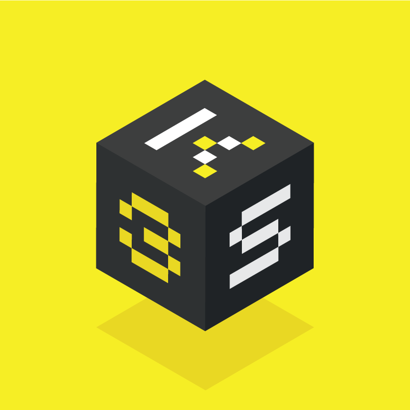
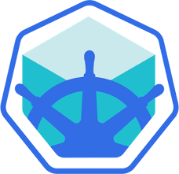

## Languages

  <table>
    <tr>
      <td align="center"><a href="tools/bash.md"> <b>Bash</b></a></td>
      <td align="center"><a href="tools/golang.md"> <b>Golang</b></a></td>
      <td align="center"><a href="tools/python.md"> <b>Python</b></a></td>
    </tr>
  </table>

##  Continuous Integration / Continuous Deployment (CI/CD)

  <table>
    <tr>
      <td align="center"><a href="tools/jenkins.md"> <b>Jenkins</b></a></td>
      <td align="center"><a href="tools/githubactions.md"> <b>GitHub Actions</b></a></td>
    </tr>
  </table>

##  Containers & Container Orchestration

  <table>
    <tr>
      <td align="center"><a href="tools/kubernetes.md"> <b>Kubernetes</b></a>
      <td align="center"><a href="tools/k3s.md"> <b>K3S</b></a>
      <td align="center"><a href="tools/openshift.md"> <b>OpenShift</b></a></td>
      <td align="center"><a href="tools/minikube.md"> <b>Minikube</b></a></td>
      <td align="center"><a href="tools/microk8s.md"> <b>MicroK8s</b></a></td>
    </tr>
  </table>

## Cloud Platforms

  <table>
    <tr>
      <td align="center"><a href="tools/aws.md"> <b>Bash</b></a></td>
      <td align="center"><a href="tools/azure.md"> <b>Golang</b></a></td>
      <td align="center"><a href="tools/gcp.md"> <b>Python</b></a></td>
    </tr>
  </table>

## Monitoring & Dashboards

  <table>
    <tr>
      <td align="center"><a href="tools/grafana.md"> <b>Grafana</b></a></td>
      <td align="center"><a href="tools/prometheus.md"> <b>Prometheus</b></a></td>
      <td align="center"><a href="tools/nagios.md"> <b>Nagios</b></a></td>
    </tr>
  </table>

## My DevOps Reading List
Name | Complete? | Comments
:------|:------:|:------:
[The Phoenix Project](https://www.amazon.com/Phoenix-Project-DevOps-Helping-Business/dp/1942788290) | ❌ | DevOps explained through a story of a fictional company on the brink of a failure
[The DevOps Handbook](https://www.amazon.com/dp/1942788002) | ❌ |
[Google SRE books](https://landing.google.com/sre/books) | ❌ | Very detailed books on the theory and also practice of SRE
[Essential Infrastructure as Code](https://www.manning.com/books/essential-infrastructure-as-code) | ❌ | VBook about automating software infrastructure by capturing desired configurations as a set of scripts.

## Cloud Native Computing Foundation's Landscape
Name | Comments
:------|:------:
[Cloud Native ~ Interactive Landscape](https://landscape.cncf.io/) | Categorization of cloud native open source projects as well as proprietary products.
[Cloud Native ~ Trail Map](https://raw.githubusercontent.com/cncf/trailmap/master/CNCF_TrailMap_latest.pdf) | Cloud native's recommended process of leveraging open source infrastructures.
[Cloud Native ~ Landscape Guide](https://landscape.cncf.io/guide) | Detailed guide on the use/implementation of the cloud native landscape.

